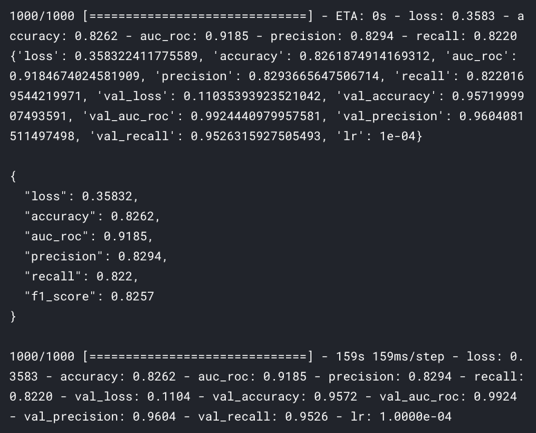
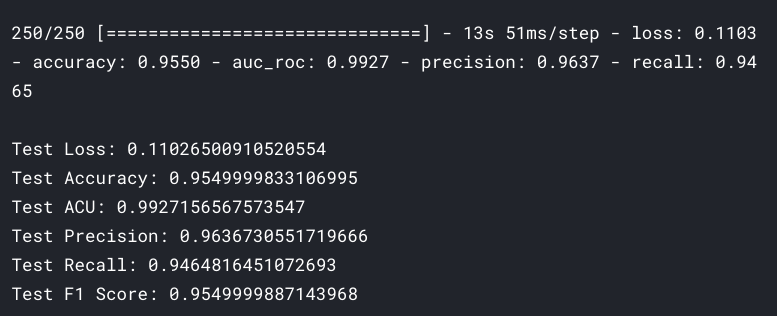
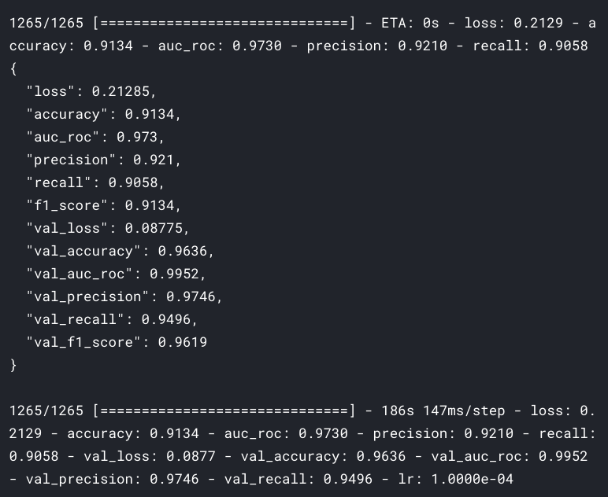
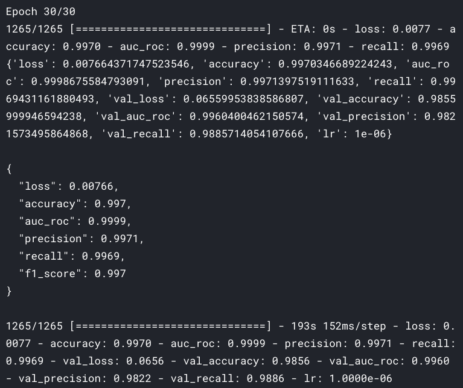

# cats-vs-dogs-the-final-showdown

[Dogs vs. Cats Redux: Kernels Edition](https://www.kaggle.com/c/dogs-vs-cats-redux-kernels-edition) is a `Kaggle`'s competition where using the dataset you have to create `classifier` that can classify images as `dog` or `cat`. The `evaluation` metirc for this competition is `cross entropy`.

## Getting started

The [notebook](https://www.kaggle.com/akashsdas/cats-vs-dogs-the-final-showdown) is available on Kaggle to work in the same environment where this notebook was created i.e. use the same version packages used, etc...

## Model info

**Count plot for the labels**

There are total `16 kernels` (versions) for this project on Kaggle. Here only info for the `best`, `latest` and `longest trained` model info is given, if you want to look at other version then go to the main [kernel](https://www.kaggle.com/akashsdas/cats-vs-dogs-the-final-showdown) and change the versions.

### Model info for the best model

**The best score for this competition is `3.47` (loss, [kernel](https://www.kaggle.com/akashsdas/cats-vs-dogs-the-final-showdown?scriptVersionId=58753175))**

Here `VGG16` model is used as the base model and the entire model is trained for `1 epoch`. Below is the snapshot of the last `epoch`.

**Model performance against testing data**

### Model info for the latest model

**The latest score for this competition is `4.68` (loss, [kernel](https://www.kaggle.com/akashsdas/cats-vs-dogs-the-final-showdown))**

Here `InceptionV3` model is used as the base model and the entire model is trained for `1 epochs`. Below is the snapshot of the last `epoch`.

**Model performance against testing data**

### Model info for the longest trained model

**The latest score for this competition is `13.72` (loss, [kernel](https://www.kaggle.com/akashsdas/cats-vs-dogs-the-final-showdown?scriptVersionId=58754139))**

Here `VGG16` model is used as the base model and the entire model is trained for `30 epochs`. Below is the snapshot of the last `epoch`.

**Accuracy and loss curves for this model**

**Model performance against testing data**

### Model predictions

**Lastest model's predictions on testing data (part of training data)**

## Visualizing feature maps

If you want to see the visualizations for the filters for `VGG16` and `InceptionV3` then they are available in [kernel_vgg16](https://www.kaggle.com/akashsdas/cats-vs-dogs-the-final-showdown?scriptVersionId=58753175) and [kernel_inceptionv3](https://www.kaggle.com/akashsdas/cats-vs-dogs-the-final-showdown) respectively.

### Feature maps for VGG16

**Animal image**

**1st conv layer**

**11th conv layer**

**17th conv layer**

### Feature maps for InceptionV3

**Animal image**

**1st conv layer**

**3rd conv layer**

**Mid conv layer**

**Last conv layer**

## Issues

Only one issue that I faced and that's during the testing(on the test data which is a part of the training data) process and use the other way to get right results.

The issue is explained in the latest [kernel](https://www.kaggle.com/akashsdas/cats-vs-dogs-the-final-showdown)'s `Evaluation` section but the summary is: while using the `ImageDataGenerator` for the testing data with the `flow_from_dataframe` method where `y_col` and the `target_size` was given, the predictions done using the `ImageDataGenerator` was wrong, this is because the confusion matrix for these predictions were giving reuslts (bad results) as compared to the results giving the `evaluate` method on `tensorflow.keras.Model`. So to avoid this issue I just took the images path for the testing data and use the `ImageDataGenerator` with the `flow` method on it without the labels info. After doing that the results were `in sync` with the results of the `evaluate` method on `tensorflow.keras.Model`.

### Latest model info

**Testing data evaluation results**

**Using the previous method**

**Using the new (right) method**

`The confusion matrix for the longest and the best models had this issue, can be viewed in their respective kernels. This issue is solved for the latest kernel`.

## License

[APACHE LICENSE, VERSION 2.0](./LICENSE)
